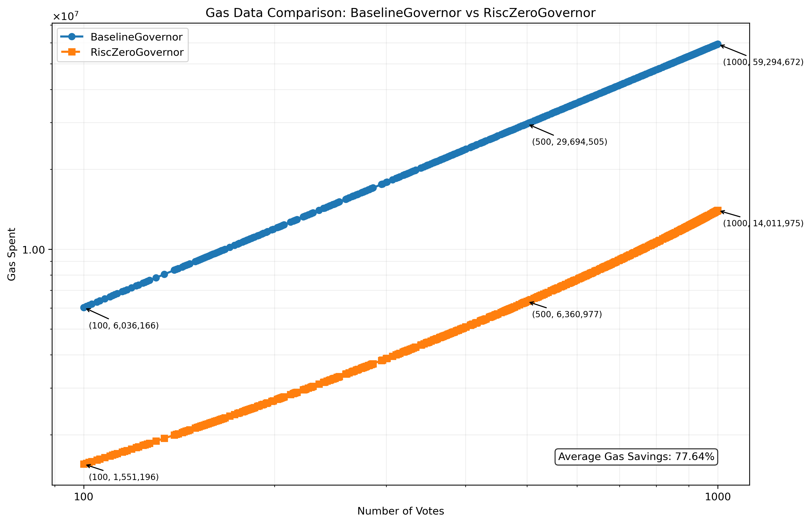

# Running this example locally

Before starting, make sure to follow the [Installation guide] to have both Rust and RISC Zero's toolchain installed. You'll also need [Foundry] to be installed.

## Setup

From the root of the example repo, run:

```sh
cargo build
forge install
forge build
```

## Running tests

> [!TIP]
> You can adjust the number of fuzz runs for each test case, by changing the `runs` variable in [foundry.toml]. Higher values gives more confidence in results at the cost of testing speed, see more info at [Fuzz - Foundry Docs].

```sh
RISC0_DEV_MODE=true forge test -vvv
```
Once completed, you should see some output similar to below.

```sh
RISC0_DEV_MODE=true forge test -vvv
[⠊] Compiling...
No files changed, compilation skipped

Ran 6 tests for tests/RiscZeroGovernorTest.sol:RiscZeroGovernorTest
[PASS] testFailToReachQuorum() (gas: 115528)
[PASS] testProposalCreation() (gas: 85596)
[PASS] testQuorumAndExecution() (gas: 251954)
[PASS] testVerifyAndFinalizeVotes() (gas: 241605)
[PASS] testVoting() (gas: 131153)
[PASS] testVotingBySignature() (gas: 222248)
Suite result: ok. 6 passed; 0 failed; 0 skipped; finished in 2.19ms (1.60ms CPU time)

Ran 6 tests for tests/BaselineGovernorTest.sol:BaselineGovernorTest
[PASS] testFailToReachQuorum() (gas: 143920)
[PASS] testProposalCreation() (gas: 63293)
[PASS] testProposalThreshold() (gas: 116790)
[PASS] testQuorumAndExecution() (gas: 198347)
[PASS] testVoting() (gas: 186488)
[PASS] testVotingBySignature() (gas: 271969)
Suite result: ok. 6 passed; 0 failed; 0 skipped; finished in 2.22ms (1.60ms CPU time)

Ran 2 tests for tests/benchmarks/BenchmarkGovernorsTest.sol:BenchmarkGovernorsTest
[PASS] testFuzz_BaselineWorkflow(uint16) (runs: 10, μ: 121437272, ~: 140488679)
[PASS] testFuzz_RiscZeroWorkflow(uint16) (runs: 10, μ: 86707673, ~: 100443114)
Suite result: ok. 2 passed; 0 failed; 0 skipped; finished in 1.86s (3.51s CPU time)

Ran 3 test suites in 1.86s (1.86s CPU time): 14 tests passed, 0 failed, 0 skipped (14 total tests) 
```

## Generating data and gas plots

In the `tests/benchmarks` folder, there are two Python files. They both handle data written to a csv from the [BenchmarkGovernorsTest.sol] file using Foundry's writing data cheatcode. 

- [print_gas_data.py]: pretty prints data from `gas_data.csv`
- [plot_gas_data.py]: generates a matplotlib plot of gas usage in .png format: [gas_data_comparison.png]

To set up your python environment, it is recommend to use a virtual environment such as `venv` or `conda`. 

### Using venv

Change into the benchmarks directory with:

```sh
cd tests/benchmarks
```

Create the virtual environment with:

```sh
python -m venv governance
```

Activate the virtual environment with:

```sh
source governance/bin/activate
```

Install the requirements with:

```sh
pip install -r requirements.txt
```

### Using conda

Change into the benchmarks directory with:

```sh
cd tests/benchmarks
```

Create the virtual environment with:

```sh
conda env create -f environment.yml
```

Activate the virtual environment with:

```sh
conda activate governance
```

## Running the print/plot python files

Change into the benchmarks directory with:

```sh
cd tests/benchmarks
```

Make sure the correct environment is activated and all the dependencies installed either with [venv] or an alternative like [conda].

The data is only generated when the tests are run, see [running tests].

```sh
python print_gas_data.py
```

```sh
python plot_gas_data.py
```

The plot generated will be saved as [gas_data_comparison.png]:




---
[conda]: #using-conda
[Foundry]: https://book.getfoundry.sh/getting-started/installation
[foundryl.toml]: ./foundry.toml
[Fuzz - Foundry Docs]: https://book.getfoundry.sh/reference/config/testing#fuzz
[gas_data_comparison.png]: ./tests/benchmarks/gas_data_comparison.png
[Installation guide]: https://dev.risczero.com/api/zkvm/install
[print_gas_data.py]: ./tests/benchmarks/print_gas_data.py
[plot_gas_data.py]: ./tests/benchmarks/plot_gas_data.py
[running tests]: #running-tests
[venv]: #using-venv

